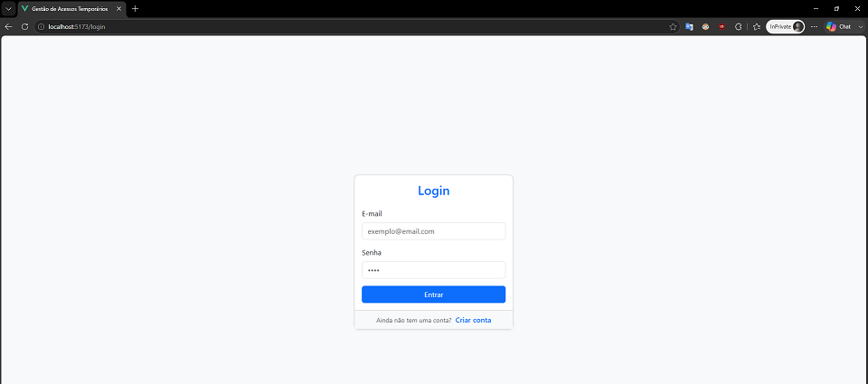
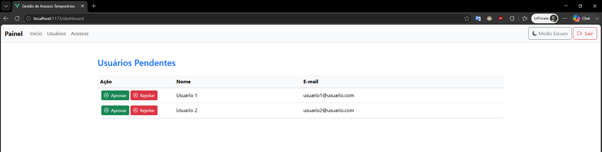
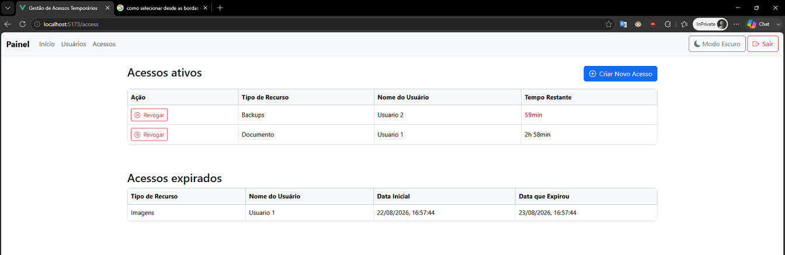
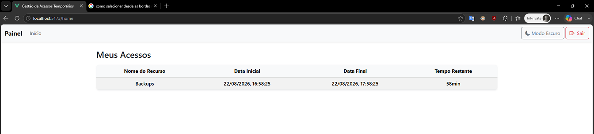

# Sistema de Gestão de Acessos Temporários

## 1. Visão geral do problema

O sistema controla acessos temporários a recursos. Um usuário se cadastra e aguarda a decisão de um administrador. Depois de aprovado, ele pode autenticar-se e consultar as permissões temporárias que recebeu.

O administrador aprova ou rejeita cadastros, concede acessos com duração limitada e pode revogá-los antes da expiração. A aplicação também identifica automaticamente os acessos expirados.

## Demonstração

### Página de login



### Painel de Usuários Pendentes - Admin



### Painel de Acessos - Admin



### Painel de Acessos - Usuário



## 2. Funcionalidades por perfil

### Público

- Cadastrar um usuário.
- Fazer login.
- Consultar a documentação OpenAPI.

### Usuário (`USER`)

- Fazer login quando seu cadastro estiver aprovado.
- Consultar seus acessos temporários.
- Visualizar o tempo restante das permissões.

### Administrador (`ADMIN`)

- Listar usuários aprovados e pendentes.
- Aprovar ou rejeitar usuários pendentes.
- Listar os acessos concedidos.
- Conceder acesso temporário a um usuário aprovado.
- Revogar um acesso ativo.

## 3. Arquitetura

O projeto é dividido em três componentes:

- **Frontend:** aplicação Vue responsável pela interface, navegação e consumo da API.
- **Backend:** API REST Spring Boot organizada em camadas `Controller -> Service -> Repository`.
- **Banco de dados:** PostgreSQL com schema versionado pelo Flyway.

No backend, DTOs delimitam os dados de entrada e saída, Spring Security e JWT cuidam da autenticação e autorização, e uma tarefa agendada processa expirações. As datas são armazenadas em UTC como `Instant` e convertidas apenas para apresentação.

No ambiente Docker padrão, somente o Nginx do frontend é publicado. O backend e o PostgreSQL permanecem em uma rede interna, e o Nginx encaminha as chamadas da API ao backend.

## 4. Tecnologias

### Backend

- Java 25.
- Spring Boot 3.5.
- Spring Web, Security, Validation, Data JPA e Actuator.
- JWT com JJWT.
- Flyway e PostgreSQL.
- Maven.
- JUnit 5, Mockito, MockMvc, Testcontainers e JaCoCo.
- springdoc-openapi e Swagger UI.
- Spotless para formatação.

### Frontend

- Vue 3, Vue Router e Pinia.
- Axios.
- Bootstrap e Bootstrap Icons.
- Vite.
- Vitest, Vue Test Utils e Playwright.

### Infraestrutura

- Docker e Docker Compose.
- Nginx.
- GitHub Actions.

## 5. Modelo de dados

### Usuário

| Campo | Descrição |
| --- | --- |
| `id` | Identificador único. |
| `nome` | Nome do usuário. |
| `email` | E-mail único usado na autenticação. |
| `senha` | Senha armazenada com hash BCrypt. |
| `role` | Perfil `ADMIN` ou `USER`. |
| `status` | Estado `PENDENTE`, `APROVADO` ou `REJEITADO`. |

### Acesso

| Campo | Descrição |
| --- | --- |
| `id` | Identificador único. |
| `nomeRecurso` | Recurso ao qual o acesso foi concedido. |
| `horaPermissao` | Início da permissão em UTC. |
| `horaExpiracao` | Expiração da permissão em UTC. |
| `revogado` | Indica revogação manual ou expiração. |
| `usuarioId` | Usuário que recebeu a permissão. |

Um usuário pode possuir vários acessos, enquanto cada acesso pertence a um único usuário.

## 6. Como executar com Docker

### Requisitos

- Docker com Docker Compose.

Copie o arquivo de exemplo e substitua os valores fictícios:

```bash
cp .env.example .env
docker compose up --build --wait
```

A aplicação estará disponível em [http://localhost:5173](http://localhost:5173).

O Compose padrão usa o perfil Spring `demo`, que cria um administrador demonstrativo com `ADMIN_NAME`, `ADMIN_EMAIL` e `ADMIN_PASSWORD`. O PostgreSQL e o backend aguardam os respectivos health checks antes que os serviços dependentes sejam iniciados.

Para desenvolvimento com recarga automática e portas do backend e do PostgreSQL expostas:

```bash
docker compose -f docker-compose.yml -f docker-compose.dev.yml up --build --wait
```

Para encerrar os serviços:

```bash
docker compose down
```

Use `docker compose down -v` somente quando também quiser apagar os dados locais do PostgreSQL.

## 7. Como executar testes

### Backend

Para executar todos os testes incluindo os de integração, é necessário que os containers Docker estejam ativos e o Java 25 local instalado.

O comando `verify` executa testes unitários, de controllers e de integração, incluindo os testes com PostgreSQL via Testcontainers, e gera o relatório JaCoCo:

```bash
cd backend
./mvnw verify
```

O relatório de cobertura fica em `backend/target/site/jacoco/index.html`.

Para verificar ou corrigir a formatação:

```bash
cd backend
./mvnw spotless:check
./mvnw spotless:apply
```

### Frontend

```bash
cd frontend
npm ci
npm test
```

Os mesmos testes unitários podem ser executados sem instalar Node localmente:

```bash
docker compose --profile test run --rm frontend-unit
```

### E2E

O fluxo E2E registra um usuário, aprova-o como administrador, faz login, concede um acesso e verifica sua revogação ou expiração:

```bash
docker compose --profile test run --rm e2e
```

O serviço E2E inicia suas dependências conforme os health checks definidos no Compose.

## 8. Documentação da API

Com o ambiente de desenvolvimento em execução, a documentação está disponível diretamente pelo backend:

- Swagger UI: [http://localhost:8080/swagger-ui/index.html](http://localhost:8080/swagger-ui/index.html)
- Especificação OpenAPI: [http://localhost:8080/v3/api-docs](http://localhost:8080/v3/api-docs)

Os endpoints estão agrupados em autenticação, usuários e acessos. A documentação apresenta payloads, exemplos, códigos de resposta, endpoints públicos ou protegidos e o perfil necessário.

Para testar um endpoint protegido, faça login, copie o token retornado e use o botão **Authorize** do Swagger. Informe somente o JWT; o prefixo `Bearer` é aplicado pelo esquema configurado.

## 9. Decisões técnicas

- **DTOs na API:** evitam expor diretamente as entidades e dados desnecessários, como a senha.
- **JWT stateless:** dispensa sessão no servidor e permite autorização por perfil.
- **BCrypt:** protege as senhas armazenadas.
- **Datas em UTC:** `Instant` evita diferenças causadas pelo fuso horário do servidor.
- **Clock injetável:** permite testar expiração sem depender do relógio real.
- **Flyway com Hibernate `validate`:** migrations controlam o schema e o Hibernate apenas verifica sua compatibilidade.
- **Problem Details:** erros da API seguem `application/problem+json` com status HTTP apropriado.
- **Imagens multi-stage:** compiladores e dependências de build não são levados para as imagens finais.
- **Usuário não privilegiado:** backend e frontend não executam como `root` nas imagens de runtime.
- **Testes separados:** os serviços de teste não são iniciados por um `docker compose up` normal.

## 10. Segurança e variáveis de ambiente

Crie `.env` a partir de `.env.example`. O arquivo de exemplo contém apenas valores fictícios e o `.env` não deve ser versionado.

| Variável | Finalidade |
| --- | --- |
| `JWT_SECRET` | Chave usada para assinar os tokens JWT; deve possuir ao menos 32 bytes. |
| `POSTGRES_DB` | Nome do banco de dados. |
| `POSTGRES_USER` | Usuário do PostgreSQL. |
| `POSTGRES_PASSWORD` | Senha do PostgreSQL. |
| `ADMIN_NAME` | Nome do administrador criado nos perfis locais. |
| `ADMIN_EMAIL` | E-mail do administrador criado nos perfis locais. |
| `ADMIN_PASSWORD` | Senha do administrador criado nos perfis locais. |
| `FRONTEND_PORT` | Porta externa do frontend. |
| `BACKEND_PORT` | Porta externa do backend no ambiente de desenvolvimento. |
| `POSTGRES_PORT` | Porta externa do PostgreSQL no ambiente de desenvolvimento. |

Em produção, use `SPRING_PROFILES_ACTIVE=prod` e forneça `JWT_SECRET` e as variáveis `SPRING_DATASOURCE_*` pelo ambiente de implantação ou por um gerenciador de segredos. O perfil de produção não cria automaticamente uma conta administrativa; ela deve ser provisionada por um processo administrativo separado.

As credenciais padrão do Compose são destinadas exclusivamente ao desenvolvimento e à demonstração. Não reutilize esses valores em produção.

## 11. Pipeline de CI

O workflow `.github/workflows/ci.yml` é executado em todo push e pull request. Seus jobs rodam em paralelo:

- **Backend:** verifica formatação, compila, executa testes e publica o relatório JaCoCo como artefato `cobertura-backend`.
- **Frontend:** executa `npm ci`, auditoria de vulnerabilidades, testes e build.
- **Containers:** valida o Docker Compose e constrói as imagens de runtime do backend e do frontend.

## 12. Próximas melhorias

Como próximos passos, o projeto pode evoluir com a implementação dos módulos responsáveis pelos recursos que serão efetivamente acessados, transformando as permissões atuais em integrações reais. Também podem ser adicionados logs estruturados, trilha de auditoria das ações administrativas, notificações sobre concessão e expiração de acessos e um processo seguro para provisionar administradores.

Outras melhorias possíveis incluem aprimoramentos de usabilidade, recuperação de senha, renovação de acessos, paginação e filtros nas listagens e ampliação dos testes E2E.
